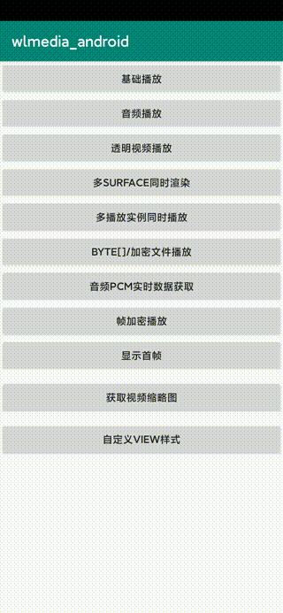
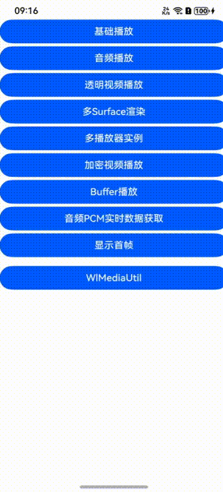
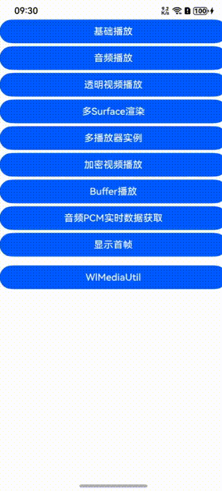
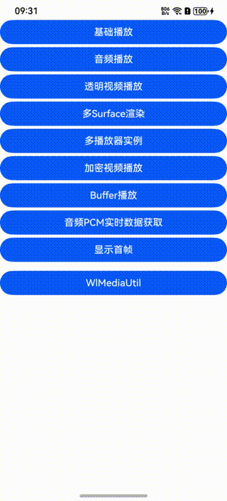
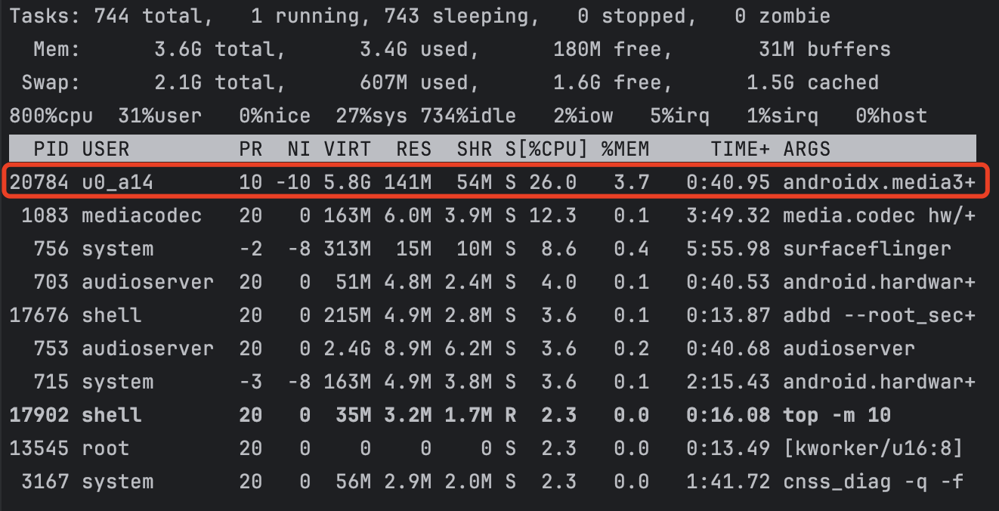
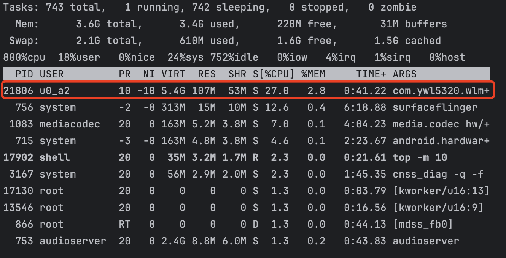
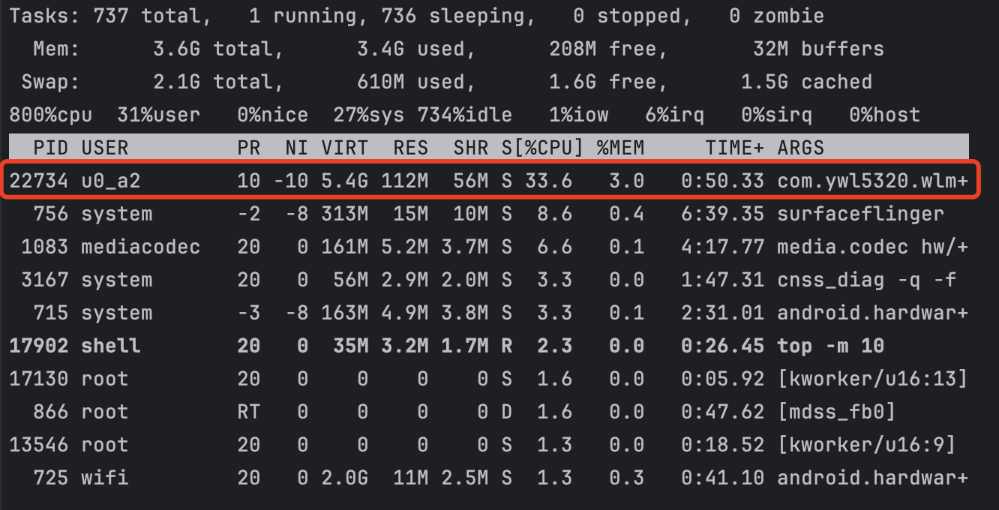
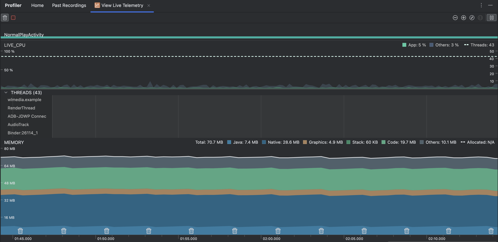

## &#x1F680;wlmedia&#x1F680;
#### Android&HarmonyOS 音视频播放SDK，几句代码即可实现音视频播放功能~
#### 使用简单，功能丰富，支持手机、车机系统、电视、电视盒子、手表等智能设备
## 一 功能&特点
- [x] 基本信息获取（音频：采样率、声道数、时长等，视频：宽、高、fps、时长等）
- [x] 支持file、http、https、udp、rtmp、rtp、rtsp、byte[]等几乎所有协议
- [x] 支持AV1解码
- [x] 可选音频、视频、音视频播放模式
- [x] 软解硬解设置
- [x] 无缝切换surface
- [x] 支持多实例播放
- [x] 支持播放完成（EOF）后，再次seek又继续播放
- [x] 支持媒体自由切换
- [x] 支持FFmpeg参数设置
- [x] 支持byte[]数据类型
- [x] 音视频加密播放
- [x] 支持音视频帧解码
- [x] 支撑音视频变速变调
- [x] 支撑透明视频播放（可实现不错的视觉效果）
- [x] 字幕选择
- [x] 内置循环播放
- [x] 链接超时设置
- [x] 缓存大小设置（时间维度）
- [x] 音轨选择
- [x] 音频指定采样率设置
- [x] 音频指定声道播放
- [x] 视频截屏
- [x] 视频首帧图片或指定时间图片获取
- [x] 视频任意比例设置
- [x] 视频旋转角度设置（0,90,180,270）
- [x] 视频镜像模式设置
- [x] 视频背景颜色设置（默认黑色）
- [x] 视频支持同时多个surface渲染（如：KTV大小屏幕）
- [x] 支持实时获取音频PCM数据 
- [x] 支持设置音视频同步偏移
- [x] 支持外部OpenGL渲染（如：Unity、Cocos2d等视频播放）


## 二 效果展示
### Android
|  常规播放  |  透明视频  |  多Surface渲染  | 多实例播放  | 播放音频 | 音量分贝  |
| :----: | :----: | :----: | :----: |:----:| ------ |
|  |  |  |  |  |  |

### HarmonyOS
|  常规播放  |  透明视频  |  多Surface渲染  | 多实例播放  | 播放音频 | 音量分贝  |
| :----: | :----: | :----: | :----: |:----:| ------ |
|  |  |  |  |  |  |

## 三 性能对比
### Android
#### VS exoplayer
|  exoplayer  |  wlplayer(no opengl)  |  wlplayer(use opengl)  | wlplayer 实时|
| :----: | :----: | :----: | :----: |
|  |  |  |  |

## 四 集成使用
### 4.1 Android
#### 4.1.1 gradle [](https://jitpack.io/#ywl5320/wlmedia)
```gradle
allprojects {
    repositories {
        ...
        maven { url 'https://jitpack.io' }
    }
}
    
dependencies {
        implementation 'com.github.ywl5320:wlmedia:4.2.0'
}
 ```
 #### 4.1.2 常用权限
 ```xml
<uses-permission android:name="android.permission.READ_EXTERNAL_STORAGE"/>
<uses-permission android:name="android.permission.INTERNET"/>
 ```

 #### 4.1.3 配置NDK编译平台
 ```gradle
 defaultConfig {
    ...
    ndk {
        abiFilter("armeabi-v7a")
        abiFilter("arm64-v8a")
        abiFilter("x86")
        abiFilter("x86_64")
        }
...
}
 ```
 #### 4.1.4 设置Surface
 ```xml
 <-- WlSurfaceView 一般播放使用 -->
 <com.ywl5320.wlmedia.widget.WlSurfaceView
     android:id="@+id/wlsurfaceview"
     android:layout_width="match_parent"
     android:layout_height="match_parent" />

 <-- WlTextureView 需要做透明、移动、旋转等使用 -->
 <com.ywl5320.wlmedia.widget.WlTextureView
     android:id="@+id/wltextureview"
     android:layout_width="match_parent"
     android:layout_height="match_parent" />
 ```
 #### 4.1.5 基础调用代码（更多功能见Demo）
 ```java
 // 1.创建播放器
 WlPlayer wlPlayer = new WlPlayer();
 wlPlayer.setOnMediaInfoListener(new WlOnMediaInfoListener() {
    @Override
    public void onPrepared() {
        // 异步准备好后回调，这里调用 wlplayer.start() 开始播放
        wlPlayer.start();
    }

    @Override
    public void onTimeInfo(double currentTime, double bufferTime) {
        // 时间进度回调 
    }

    @Override
    public void onComplete(WlCompleteType wlCompleteType, String s) {
        // 播放完成回调，根据 WlCompleteType 区分对应类型
        if (wlCompleteType == WlCompleteType.WL_COMPLETE_EOF) {
            // 正常播放完成
        } else if (wlCompleteType == WlCompleteType.WL_COMPLETE_ERROR) {
            // 播放出错，原因为：msg 字段
        } else if (wlCompleteType == WlCompleteType.WL_COMPLETE_HANDLE) {
            // 主动调用 wlPlayer.stop() 会回调此类型
        } else if (wlCompleteType == WlCompleteType.WL_COMPLETE_NEXT) {
            // 正在播放中，切换了新的数据源，会回调此类型
        } else if (wlCompleteType == WlCompleteType.WL_COMPLETE_TIMEOUT) {
            // 播放超时，会回调此接口
        } else if (wlCompleteType == WlCompleteType.WL_COMPLETE_LOOP) {
            // 循环播放中，每开始新的一次循环，会回调此接口
        }
    }

    @Override
    public void onLoad(WlLoadStatus loadStatus, int progress, long speed) {
        // 加载状态回调
        if (wlLoadStatus == WlLoadStatus.WL_LOADING_STATUS_START) {
            // 开始加载
        } else if (wlLoadStatus == WlLoadStatus.WL_LOADING_STATUS_PROGRESS) {
            // 加载进度
        } else if (wlLoadStatus == WlLoadStatus.WL_LOADING_STATUS_FINISH) {
            // 加载完成
        }
    }

    @Override
    public void onSeekFinish() {
        // seek 完成回调
    }

    @Override
    public void onFirstFrameRendered() {
        // 首帧渲染回调
    }
});

 // 2.获取 WlSurfaceView 并绑定播放器
 WlSurfaceView wlSurfaceView = findViewById(R.id.wlsurfaceview);
 wlSurfaceView.setWlPlayer(wlPlayer);
 // 可选
 wlSurfaceView.setClearLastVideoFrame(false); // 设置不清屏
 wlSurfaceView.setVideoScale(WlScaleType.WL_SCALE_FIT); // 设置缩放模式
 wlSurfaceView.setVideoRotate(WlRotateType.WL_ROTATE_90); // 设置旋转角度
 wlSurfaceView.setVideoMirror(WlMirrorType.WL_MIRROR_TOP_BOTTOM); // 设置镜像模式

 // 3.设置数据源异步准备
 wlPlayer.setSource(url);
 wlPlayer.prepare();
 ```
### [更多使用方式](doc/android/android.md)
### 4.2 HarmonyOS
#### 4.2.1 导入SDK [仓库地址](https://ohpm.openharmony.cn/#/cn/detail/@ywl5320%2Flibwlmedia)
```
ohpm i @ywl5320/libwlmedia
```
#### 4.2.2 常用权限
```json5
#module.json5
"requestPermissions": [
    {
    "name": "ohos.permission.INTERNET"
    }
]
```

#### 4.2.3 设置XComponentController
```typescript
let wlPlayer: WlPlayer = new WlPlayer();
let wlComponentController: WlComponentController = new WlComponentController(this.wlPlayer);
...
XComponent({
        type: XComponentType.SURFACE,
        controller: this.wlComponentController
    })
    .width('100%')
    .height('100%')
...
```
#### 4.2.4 基础调用代码（更多功能见Demo）
```typescript
@Entry
@Component
struct Index{
    private wlPlayer: WlPlayer | null = null;
    private wlComponentController: WlComponentController | null = null;

    aboutToAppear(): void {
        this.wlPlayer = new WlPlayer();
        this.wlPlayer.setOnMediaInfoListener({
        onPrepared: (): void => {
            // 异步准备好后回调，这里调用 wlplayer.start() 开始播放
            this.wlPlayer?.start();
        },
        onTimeInfo: (currentTime: number, bufferTime: number): void => {
            // 时间进度回调 
        },
        onComplete: (wlCompleteType: WlCompleteType, msg: string): void => {
            if (wlCompleteType == WlCompleteType.WL_COMPLETE_EOF) {
                // 正常播放完成
            } else if (wlCompleteType == WlCompleteType.WL_COMPLETE_ERROR) {
                // 播放出错，原因为：msg 字段
            } else if (wlCompleteType == WlCompleteType.WL_COMPLETE_HANDLE) {
                // 主动调用 wlPlayer.stop() 会回调此类型
            } else if (wlCompleteType == WlCompleteType.WL_COMPLETE_NEXT) {
                // 正在播放中，切换了新的数据源，会回调此类型
            } else if (wlCompleteType == WlCompleteType.WL_COMPLETE_TIMEOUT) {
                // 播放超时，会回调此接口
            } else if (wlCompleteType == WlCompleteType.WL_COMPLETE_LOOP) {
                // 循环播放中，每开始新的一次循环，会回调此接口
            }
        },
        onLoadInfo: (loadStatus: WlLoadStatus, progress: number, speed: number): void => {
            // 加载状态回调
            if (wlLoadStatus == WlLoadStatus.WL_LOADING_STATUS_START) {
            // 开始加载
            } else if (wlLoadStatus == WlLoadStatus.WL_LOADING_STATUS_PROGRESS) {
            // 加载进度
            } else if (wlLoadStatus == WlLoadStatus.WL_LOADING_STATUS_FINISH) {
            // 加载完成
            }
        },
        onFirstFrameRendered: (): void => {
            // seek 完成回调
        },
        onSeekFinish: (): void => {
            // seek 完成回调
        },
        onAudioInterrupt: (type: WlAudioInterruptType, hint: WlAudioInterruptHint) => {
            // 音频打断，和系统一致
        }
        this.wlComponentController = new WlComponentController(this.wlPlayer);
        this.wlPlayer.setClearLastVideoFrame(this.wlComponentController.getUniqueNum(), false);
    }

    // 退出 销毁资源
    onBackPress(): boolean | void {
        this.wlPlayer?.release()
    }

    build() {
        Column() {
            XComponent({
          type: XComponentType.SURFACE,
          controller: this.wlComponentController
        })
          .onLoad((event) => {
            // 加载完成后就开始播放
            this.wlPlayer?.setSource(this.filesDir + "/huoying_cut.mkv");
            this.wlPlayer?.prepare();
          })
          .width('100%')
          .height('100%')
        }
    }
}

```
### [更多使用方式](doc/ohos/harmonyos.md)

## 五 免费和增值服务
`WlMedia` 是按应用根据 `包名` 定制的，分免费版和付费定制版
### 免费版
- 仅`视频画面`带有`wlmedia`水印，其余功能无限制

### 增值版
- 如要定制去水印，可付费根据包名定制打包，具体费用和规则请邮件联系：
  - 邮箱：[ywl5320@163.com](mailto:ywl5320@163.com)

## 六 讨论群（1085618246）


## 七 核心三方库
- [ffmpeg](http://ffmpeg.org/)
- [openssL](https://github.com/openssl/openssl)
- [soundtouch](http://www.surina.net/soundtouch/)
- [dav1d](https://code.videolan.org/videolan/dav1d)

#### Update By：ywl5320 2025-04-05
#### Create By：ywl5320 2019-12-16
